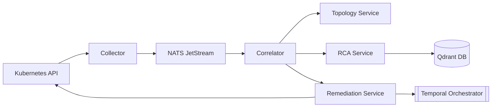

# CortexOps

**Autonomous Kubernetes Operations & Remediation Control Plane**

[](https://opensource.org/licenses/MIT)
[](https://goreportcard.com/report/github.com/shadow0vortex/cortexops)
[](https://github.com/shadow0vortex/cortexops/actions/workflows/ci.yaml)

CortexOps is an event-driven, topology-aware control plane extension for Kubernetes. It ingests infrastructure telemetry, builds deterministic causal chains, provides RAG-grounded advisory Root Cause Analysis (RCA), and safely orchestrates policy-governed remediations via Temporal.

Designed for high-scale Site Reliability Engineering (SRE) teams, CortexOps addresses the MTTR crisis by bridging the gap between passive monitoring and autonomous self-healing—without sacrificing operational safety.

---

## 🚀 Key Features

*   **Telemetry Normalization**: Ingests disparate K8s events and metrics into strongly-typed Protobuf envelopes.
*   **Topology Intelligence**: In-memory Directed Graph backed by asynchronous PostgreSQL persistence, maintaining cluster dependencies for sub-millisecond blast-radius traversal.
*   **Causal Correlation**: Deterministic heuristic-based scoring engine that groups symptoms into incidents using TraceIDs, time, and topology, fortified against event flooding.
*   **Advisory RAG RCA**: Context-grounded AI analysis via a live LLM integration and Qdrant Vector DB, complete with strict degraded-mode heuristics for safety.
*   **Durable Remediation**: Temporal-orchestrated workflows for `POD_RESTART`, `ROLLOUT_RESTART`, and `SCALING`, with deterministic verification and strict rollback state capture.
*   **Governance by OPA**: Every action is rigorously validated against a fail-closed Open Policy Agent (OPA) engine before execution.

---

## 🏗 Architecture

CortexOps is built as a set of decoupled Go microservices.



*For more details, see our [Architecture Diagram Suite](docs/architecture/telemetry_ingestion.md).*

---

## 🚦 Quick Start

### 1. Start Infrastructure & Services
Deploy the full stack (NATS, Temporal, Qdrant, Postgres, Grafana + CortexOps Microservices):
```bash
make dev-up
```

### 2. Verify System Health
Ensure all subsystems (PostgreSQL, Temporal, Qdrant) are online:
```bash
make verify-runtime
```

### 3. Bootstrap Cluster Integration
Deploy CortexOps DaemonSets and Webhooks into your cluster:
```bash
make bootstrap
```

### 4. Monitor Operations
- **Grafana**: `http://localhost:3000` (Incident Tracking & OPA Metrics)
- **Temporal UI**: `http://localhost:8233` (Remediation Lifecycle & Rollbacks)
- **Diagnostics API**: `make diagnostics`

---

## 🛡 Operational Guarantees

### Determinism Over "Magic"
The correlation engine is a math-driven state machine. AI is strictly confined to an advisory enrichment layer and cannot trigger infrastructure mutations.

### Replay Safety
Utilizing NATS JetStream deduplication and event-timestamp-driven windowing, replaying identical telemetry bursts always yields the same causal results.

### Fail-Closed Governance
Every remediation is dry-run against the K8s API. If an anomaly is detected, or if stabilization verification fails, the orchestrator automatically rolls back the mutation.

---

## 📂 Documentation

*   [**Architecture Overview**](docs/ARCHITECTURE_OVERVIEW.md): Component roles and communication matrix.
*   [**Engineering Decisions**](docs/ENGINEERING_DECISIONS.md): The rationale behind our architectural design.
*   [**Operational Playbooks**](docs/playbooks/INCIDENT_RESPONSE.md): Runbooks for platform maintenance and incident response.

---

## 🤝 Contributing

We welcome contributions! Please see our [Contributing Guide](CONTRIBUTING.md) and [Code of Conduct](CODE_OF_CONDUCT.md).

### Security
To report a vulnerability, please refer to our [Security Policy](SECURITY.md).

---

## 📜 License

MIT License. See [LICENSE](LICENSE) for details.

---

**Operational Safety Disclaimer**: CortexOps modifies Kubernetes state. While governed by OPA and Temporal safeties, autonomous remediation carries inherent risks. Ensure rigorous dry-run testing before authorizing `EXECUTING` states in production.
