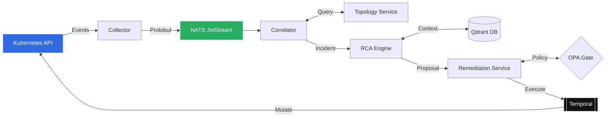

<div align="center">
  <h1>🌌 CortexOps</h1>
  <p><b>Autonomous Kubernetes Operations & Remediation Control Plane</b></p>
  
  [](https://opensource.org/licenses/MIT)
  [](https://goreportcard.com/report/github.com/shadow0vortex/cortexops)
  [](https://kubernetes.io/)
  [](https://temporal.io/)
  
  [](https://github.com/shadow0vortex/cortexops/actions/workflows/backend.yml)
  [](https://github.com/shadow0vortex/cortexops/actions/workflows/frontend.yml)
  [](https://github.com/shadow0vortex/cortexops/actions/workflows/docker.yml)
  [](https://github.com/shadow0vortex/cortexops/actions/workflows/security.yml)
</div>

<br/>

CortexOps is an enterprise-grade, event-driven control plane extension for Kubernetes. It addresses the MTTR (Mean Time To Recovery) crisis by bridging the gap between passive monitoring and autonomous self-healing—without sacrificing operational safety.

By ingesting raw infrastructure telemetry, building deterministic causal chains, and orchestrating policy-governed remediations, CortexOps acts as a tireless, high-scale SRE for your clusters.

---

## ✨ Platform Highlights

- 📡 **Telemetry Normalization**: Ingests disparate K8s events and metrics into strongly-typed Protobuf envelopes for standardized processing.
- 🧠 **Topology Intelligence**: An in-memory Directed Graph backed by PostgreSQL (`pgx/v5`), maintaining real-time cluster dependencies for sub-millisecond blast-radius traversal.
- ⚡ **Causal Correlation**: Deterministic heuristic scoring engine that groups symptoms into incidents using TraceIDs, time, and topology—immune to event flooding.
- 🤖 **Advisory RAG RCA**: Context-grounded AI analysis via a live LLM integration and Qdrant Vector DB, fortified with strict degraded-mode heuristics for absolute safety.
- 🏗️ **Durable Remediation**: Temporal-orchestrated workflows for zero-downtime recoveries (`POD_RESTART`, `ROLLOUT_RESTART`, `SCALING`), featuring deterministic verification and rollback capabilities.
- 🛡️ **Zero-Trust Governance**: Every remediation action is rigorously validated against a fail-closed Open Policy Agent (OPA) engine—including maintenance window enforcement—prior to execution.

---

## 🏛️ Architecture

CortexOps is built on a modern, decoupled microservice architecture:



> 📖 *For an in-depth dive into the system design, read the [Architecture Overview](docs/ARCHITECTURE_OVERVIEW.md).*

---

## 🚀 Quick Start

### Prerequisites
- Docker & Docker Compose v2+
- `~/.kube/config` pointing to a Kubernetes cluster (for `collector` and `remediation`)

### 1. Spin up the Infrastructure
Deploy the full stack (NATS, Temporal, Qdrant, PostgreSQL, Grafana, Loki, and all CortexOps services):
```bash
make dev-up
```

### 2. Verify System Health
Ensure all components are communicating:
```bash
make verify-runtime
```

### 3. Access the Dashboards

| Service | URL | Credentials |
|---------|-----|-------------|
| **Documentation Portal** (Next.js) | `http://localhost:3000` | — |
| **Grafana** (Metrics & Logs) | `http://localhost:3000` | Anonymous admin |
| **Temporal UI** (Workflows) | `http://localhost:8233` | `admin / password` |
| **Prometheus** (Raw Metrics) | `http://localhost:9090` | — |
| **NATS Monitoring** | `http://localhost:8222` | — |

### 4. Run Chaos Tests
```bash
# Duplicate event storm (tests deduplication)
go run ./cmd/chaos -- --test duplicate-storm --count 1000

# Workflow idempotency test
go run ./cmd/chaos -- --test workflow-idempotency
```

---

## 🏗️ Project Structure

```
cortexops/
├── api/v1/                     # Protobuf service definitions
├── build/docker/               # Multi-stage Dockerfiles (non-root runtime)
├── cmd/                        # Service entrypoints
│   ├── collector/              # K8s event ingestion
│   ├── correlator/             # Incident correlation engine
│   ├── topology/               # Dependency graph service
│   ├── rca/                    # Root Cause Analysis (LLM + heuristic)
│   ├── remediation/            # Temporal workflow executor
│   ├── chaos/                  # Chaos testing CLI
│   └── demo/                   # Demo event generator
├── deploy/
│   ├── argocd/                 # GitOps Application manifest
│   ├── compose/                # Docker Compose (dev environment)
│   ├── grafana/                # Pre-provisioned dashboards & datasources
│   ├── helm/cortexops/         # Production Helm chart
│   ├── loki/                   # Log aggregation configuration
│   ├── nats/                   # NATS NKey production config
│   ├── prometheus/             # Metrics scraping & alerting rules
│   ├── promtail/               # Container log collection
│   └── scripts/                # Backup automation
├── frontend/                   # Next.js documentation portal
├── internal/                   # Private application logic
│   ├── diagnostics/            # Versioned REST API (Bearer auth)
│   ├── orchestration/temporal/ # Durable workflow definitions
│   ├── remediation/            # Policy engine, approval, K8s executor
│   ├── rca/                    # LLM integration & vector search
│   └── topology/graph/         # Graph store (in-memory + PostgreSQL)
├── migrations/                 # Versioned SQL migrations (golang-migrate)
├── pkg/                        # Shared libraries
│   ├── broker/                 # NATS JetStream abstraction
│   ├── logger/                 # Structured JSON logging (slog)
│   ├── middleware/             # CORS middleware
│   ├── telemetry/              # Prometheus + OpenTelemetry
│   ├── topology/               # Topology HTTP client
│   └── validation/             # Input validation
└── test/e2e/                   # End-to-end & chaos tests
```

---

## 🛡️ Security & Operational Guarantees

### Security Posture
- **Non-root containers**: All services run as UID 10001 — no privilege escalation
- **Authenticated APIs**: Diagnostics API protected by Bearer token (`DIAG_API_TOKEN`)
- **NATS authentication**: User/password in dev; NKey with per-service pub/sub permissions in production
- **Network segmentation**: Kubernetes `NetworkPolicy` per service (default-deny ingress)
- **Least-privilege RBAC**: Per-service `ServiceAccount`s; only `collector` and `remediation` have K8s API bindings
- **HTTP security headers**: CSP, X-Frame-Options, X-Content-Type-Options, Referrer-Policy, Permissions-Policy
- **OPA governance**: Fail-closed policy gate with maintenance window enforcement

### Operational Guarantees
- **Determinism Over "Magic"**: The correlation engine is a strictly mathematical state machine. AI is confined to an advisory enrichment layer and **cannot** trigger infrastructure mutations directly.
- **Replay Safety**: Built on NATS JetStream deduplication and event-timestamp windowing, replaying identical telemetry bursts will always yield the exact same causal results.
- **Fail-Closed Governance**: Every remediation is dry-run against the Kubernetes API and gated by OPA. If an anomaly is detected, or if stabilization fails, the orchestrator automatically rolls back the mutation.
- **Maintenance Windows**: OPA rules automatically block all automated remediation during scheduled maintenance periods.

---

## 📊 Observability Stack

CortexOps ships with a fully integrated observability stack:

| Component | Purpose | Config |
|-----------|---------|--------|
| **Prometheus** | Metrics collection from all 5 services | `deploy/prometheus/` |
| **Grafana** | Pre-provisioned dashboards for operations | `deploy/grafana/` |
| **Loki** | Centralized log aggregation | `deploy/loki/` |
| **Promtail** | Container log scraping | `deploy/promtail/` |
| **OpenTelemetry** | Distributed tracing (OTLP export) | `pkg/telemetry/` |
| **Alerting Rules** | Service down, high error rate, latency SLOs | `deploy/prometheus/rules.yml` |

---

## 🚢 Deployment

### Docker Compose (Development)
```bash
# Full stack (all services + observability + infra)
docker compose -f deploy/compose/docker-compose.dev.yaml --profile full up -d

# Infrastructure only (NATS, Postgres, Temporal, Qdrant)
docker compose -f deploy/compose/docker-compose.dev.yaml --profile infra up -d
```

### Helm (Production Kubernetes)
```bash
# Lint the chart
helm lint deploy/helm/cortexops

# Install with required image tag
helm install cortexops deploy/helm/cortexops \
  --namespace cortexops --create-namespace \
  --set image.tag=v1.0.0
```

### ArgoCD (GitOps)
```bash
kubectl apply -f deploy/argocd/application.yaml
```

The ArgoCD Application is configured with `selfHeal: true` and `prune: true` for fully automated GitOps deployment.

---

## 🔄 Backup & Recovery

Automated backups run hourly via the `backup-cron` container:
- **PostgreSQL**: Full `pg_dump` snapshots
- **Qdrant**: Native vector DB snapshots via REST API
- **Retention**: 7-day rolling window with automatic pruning
- **Volume**: Persisted to `backupdata` Docker volume

---

## 📚 Documentation Matrix

### Core Documentation
| Document | Description |
| :--- | :--- |
| [**Feature Matrix**](docs/FEATURE_MATRIX.md) | Authoritative mapping of implemented vs. planned capabilities. |
| [**Architecture Overview**](docs/ARCHITECTURE_OVERVIEW.md) | Component roles, data flows, and communication matrices. |
| [**Engineering Decisions (ADRs)**](docs/ENGINEERING_DECISIONS.md) | The rationale behind our core architectural and technical choices. |
| [**Runtime Operations**](docs/RUNTIME_OPERATIONS.md) | Guides for operating CortexOps in production and monitoring health. |
| [**Debugging Guide**](docs/DEBUGGING_GUIDE.md) | Runbooks for troubleshooting the pipeline and microservices. |

### Validation & Testing Evidence
| Document | Description |
| :--- | :--- |
| [**Production Readiness**](docs/PRODUCTION_READINESS_FINAL.md) | The ultimate verdict on the operational status of CortexOps. |
| [**Load Test Results**](docs/LOAD_TEST_RESULTS.md) | Ingestion throughput and memory limits at 100k events/sec. |
| [**Security Hardening Report**](docs/SECURITY_HARDENING_REPORT.md) | Audit of RBAC, Pod Security Contexts, and OPA policies. |
| [**Replay Validation**](docs/REPLAY_VALIDATION.md) | Evidence of idempotency and replay safety guarantees. |
| [**GKE Deployment Report**](docs/GKE_DEPLOYMENT_REPORT.md) | Structural compliance with Google Kubernetes Engine standards. |

---

## 📦 Releases

### `v1.0.0-production` — Helm & Kubernetes Hardening
- Readiness and liveness probes (`/debug/healthz`) on all 5 services
- Per-service `NetworkPolicy` resources (default-deny ingress, explicit egress)
- Per-service `ServiceAccount`s with least-privilege RBAC (only `collector` and `remediation` get K8s API bindings)
- Bearer token authentication on the diagnostics REST API (`DIAG_API_TOKEN`)
- API version prefix: `/v1/topology/nodes`, `/v1/topology/blast-radius/{id}`
- OPA maintenance window deny rule (`input.maintenance_window == true`)
- ArgoCD `Application` manifest with automated sync, self-heal, and prune
- NATS NKey authorization config with per-service publish/subscribe permissions
- Per-service PostgreSQL schemas via versioned migration (`000002_per_service_schemas`)

### `v0.6.0-platform` — Platform Integration
- Traefik Docker labels and routing rules for `grafana` and `temporal-ui`
- BasicAuth middleware on Temporal UI via Traefik
- Uptime Kuma auto-discovery labels on `topology`, `grafana`, `temporal-ui`
- Homepage dashboard labels with service grouping, icons, and descriptions
- HTTP security headers (CSP, X-Frame-Options, Referrer-Policy, Permissions-Policy) in `next.config.ts`

### `v0.5.0-hardened` — Infrastructure Hardening
- Non-root container user (`cortexops`, UID 10001) in `Dockerfile.base`
- Named `cortexops-dev` bridge network for Docker Compose isolation
- Resource limits (`cpus: 0.5`, `memory: 512M`) on all microservice containers
- NATS user/password authentication across all services and CLI tools
- Cross-platform kubeconfig mount (`~/.kube/config` replacing `${USERPROFILE}`)
- Removed mutable `latest` image tag from Helm `values.yaml`; CI must inject semver

### `v0.4.0-data` — Data Layer
- Database migration framework (`golang-migrate/migrate/v4`) replacing inline DDL
- PostgreSQL upgrade from `15-alpine` to `17-alpine`
- Database driver migration from `lib/pq` to `jackc/pgx/v5` with native connection pooling
- Automated `pg_dump` + Qdrant snapshot backups via `backup-cron` container (1h interval, 7-day retention)
- Loki + Promtail log aggregation stack integrated into Docker Compose

### `v0.3.0-observability` — Observability
- `/metrics` Prometheus endpoint on all 5 services
- OpenTelemetry OTLP trace exporter wired into each service
- `PrometheusMetrics` race condition fix (`sync.Mutex`)
- Grafana auto-provisioning (Prometheus + Loki datasources, CortexOps dashboard)
- Prometheus alerting rules (service down, high error rate, latency thresholds)
- `/debug/healthz` health endpoints on `correlator`, `rca`, `remediation`

### `v0.2.0-foundation` — Security & Build Foundation
- Removed leaked binaries (`chaos.exe`) and rendered secrets (`rendered-template.yaml`)
- Multi-stage `frontend/Dockerfile` for Next.js standalone deployment
- Go version alignment between CI workflows and `go.mod`
- Security CI gates enforced (removed `continue-on-error: true`)
- `.gitignore` hardened against binary and secret re-commits

### `v0.1.0-mvp` — Initial Release
- Core event-driven pipeline: Collector → Correlator → RCA → Remediation
- NATS JetStream message bus with Protobuf serialization
- Temporal-orchestrated remediation workflows
- OPA policy engine for fail-closed governance
- In-memory topology graph with PostgreSQL persistence
- Qdrant vector DB integration for RAG-based root cause analysis
- Next.js documentation portal

---

## 🤝 Contributing & Security

We welcome contributions from the community! Please see our [Contributing Guide](CONTRIBUTING.md) and adhere to our [Code of Conduct](CODE_OF_CONDUCT.md).

For vulnerability disclosures, please refer to our [Security Policy](SECURITY.md).

---

<div align="center">
  <p><b>CortexOps</b> is released under the <a href="LICENSE">MIT License</a>.</p>
  <p>⚠️ <i><b>Disclaimer:</b> CortexOps modifies Kubernetes state autonomously. Ensure rigorous dry-run testing before authorizing EXECUTING states in production.</i></p>
</div>
