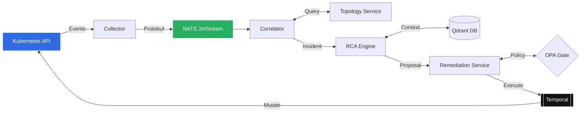

<div align="center">
  <h1>🌌 CortexOps</h1>
  <p><b>Autonomous Kubernetes Operations & Remediation Control Plane</b></p>
  
  [](https://opensource.org/licenses/MIT)
  [](https://goreportcard.com/report/github.com/shadow0vortex/cortexops)
  [](https://kubernetes.io/)
  [](https://temporal.io/)
</div>

<br/>

CortexOps is an enterprise-grade, event-driven control plane extension for Kubernetes. It addresses the MTTR (Mean Time To Recovery) crisis by bridging the gap between passive monitoring and autonomous self-healing—without sacrificing operational safety.

By ingesting raw infrastructure telemetry, building deterministic causal chains, and orchestrating policy-governed remediations, CortexOps acts as a tireless, high-scale SRE for your clusters.

---

## ✨ Platform Highlights

- 📡 **Telemetry Normalization**: Ingests disparate K8s events and metrics into strongly-typed Protobuf envelopes for standardized processing.
- 🧠 **Topology Intelligence**: An in-memory Directed Graph backed by PostgreSQL, maintaining real-time cluster dependencies for sub-millisecond blast-radius traversal.
- ⚡ **Causal Correlation**: Deterministic heuristic scoring engine that groups symptoms into incidents using TraceIDs, time, and topology—immune to event flooding.
- 🤖 **Advisory RAG RCA**: Context-grounded AI analysis via a live LLM integration and Qdrant Vector DB, fortified with strict degraded-mode heuristics for absolute safety.
- 🏗️ **Durable Remediation**: Temporal-orchestrated workflows for zero-downtime recoveries (`POD_RESTART`, `ROLLOUT_RESTART`, `SCALING`), featuring deterministic verification and rollback capabilities.
- 🛡️ **Zero-Trust Governance**: Every remediation action is rigorously validated against a fail-closed Open Policy Agent (OPA) engine prior to execution.

---

## 🏛️ Architecture

CortexOps is built on a modern, decoupled microservice architecture:



> 📖 *For an in-depth dive into the system design, read the [Architecture Overview](docs/ARCHITECTURE_OVERVIEW.md).*

---

## 🚀 Quick Start

Deploying the full CortexOps stack locally takes just a few commands.

### 1. Spin up the Infrastructure
Deploy the required subsystems (NATS, Temporal, Qdrant, PostgreSQL, Grafana, and CortexOps core):
```bash
make dev-up
```

### 2. Verify System Health
Ensure all components are communicating securely:
```bash
make verify-runtime
```

### 3. Access the Dashboards
- **Documentation Portal** (Next.js): `cd frontend && npm run dev` → `http://localhost:3000`
- **Temporal UI** (Workflow Lifecycle): `http://localhost:8233`

---

## 🛡️ Operational Guarantees

We believe autonomous operations must be fundamentally safe.

- **Determinism Over "Magic"**: The correlation engine is a strictly mathematical state machine. AI is confined to an advisory enrichment layer and **cannot** trigger infrastructure mutations directly.
- **Replay Safety**: Built on NATS JetStream deduplication and event-timestamp windowing, replaying identical telemetry bursts will always yield the exact same causal results.
- **Fail-Closed Governance**: Every remediation is dry-run against the Kubernetes API and gated by OPA. If an anomaly is detected, or if stabilization fails, the orchestrator automatically rolls back the mutation.

---

## 📚 Documentation Matrix

Explore our comprehensive documentation suite:

### Core Documentation
| Document | Description |
| :--- | :--- |
| [**Feature Matrix**](docs/FEATURE_MATRIX.md) | Authoritative mapping of implemented vs. planned capabilities. |
| [**Architecture Overview**](docs/ARCHITECTURE_OVERVIEW.md) | Component roles, data flows, and communication matrices. |
| [**Engineering Decisions (ADRs)**](docs/ENGINEERING_DECISIONS.md) | The rationale behind our core architectural and technical choices. |
| [**Runtime Operations**](docs/RUNTIME_OPERATIONS.md) | Guides for operating CortexOps in production and monitoring health. |
| [**Debugging Guide**](docs/DEBUGGING_GUIDE.md) | Runbooks for troubleshooting the pipeline and microservices. |

### Validation & Testing Evidence
| Document | Description |
| :--- | :--- |
| [**Production Readiness**](docs/PRODUCTION_READINESS_FINAL.md) | The ultimate verdict on the operational status of CortexOps. |
| [**Load Test Results**](docs/LOAD_TEST_RESULTS.md) | Ingestion throughput and memory limits at 100k events/sec. |
| [**Security Hardening Report**](docs/SECURITY_HARDENING_REPORT.md) | Audit of RBAC, Pod Security Contexts, and OPA policies. |
| [**Replay Validation**](docs/REPLAY_VALIDATION.md) | Evidence of idempotency and replay safety guarantees. |
| [**GKE Deployment Report**](docs/GKE_DEPLOYMENT_REPORT.md) | Structural compliance with Google Kubernetes Engine standards. |

---

## 🤝 Contributing & Security

We welcome contributions from the community! Please see our [Contributing Guide](CONTRIBUTING.md) and adhere to our [Code of Conduct](CODE_OF_CONDUCT.md).

For vulnerability disclosures, please refer to our [Security Policy](SECURITY.md).

---

<div align="center">
  <p><b>CortexOps</b> is released under the <a href="LICENSE">MIT License</a>.</p>
  <p>⚠️ <i><b>Disclaimer:</b> CortexOps modifies Kubernetes state autonomously. Ensure rigorous dry-run testing before authorizing EXECUTING states in production.</i></p>
</div>
