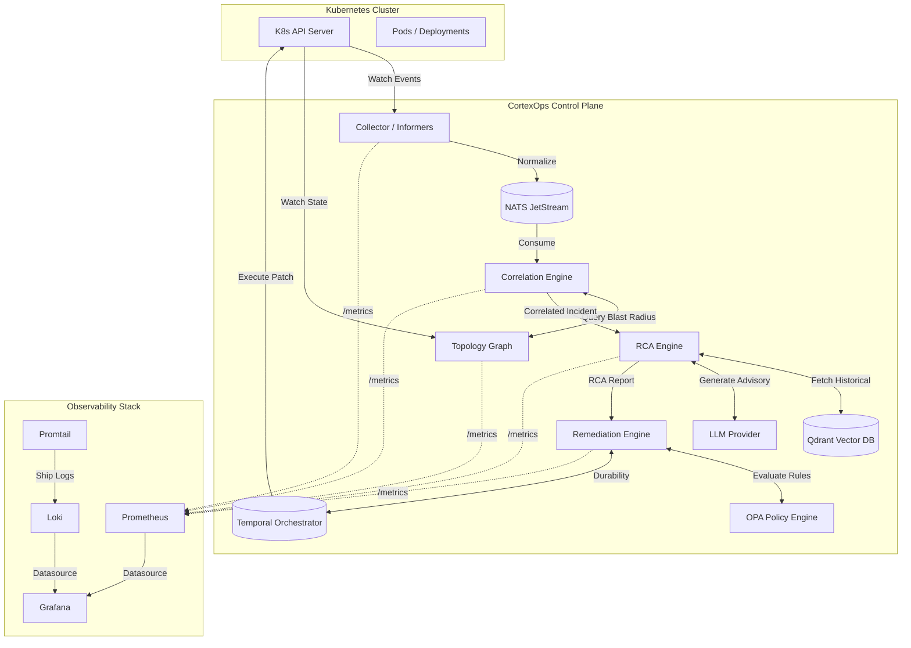
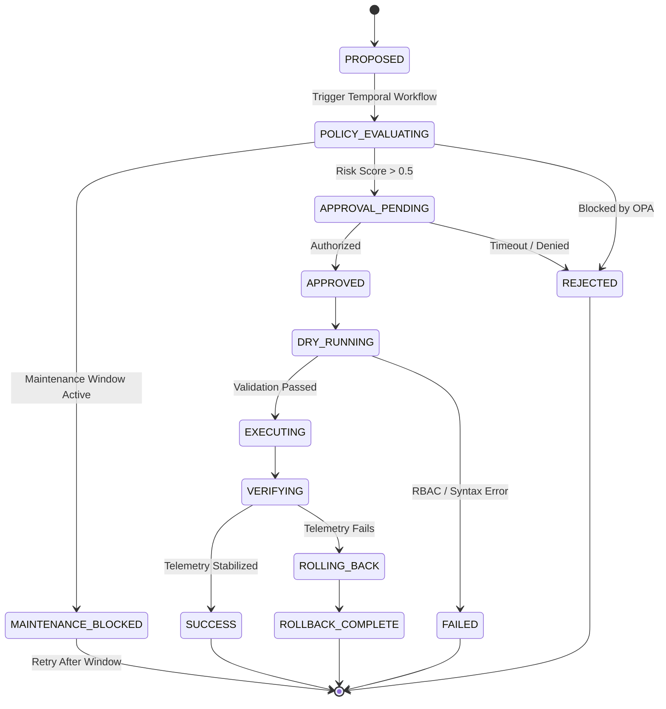
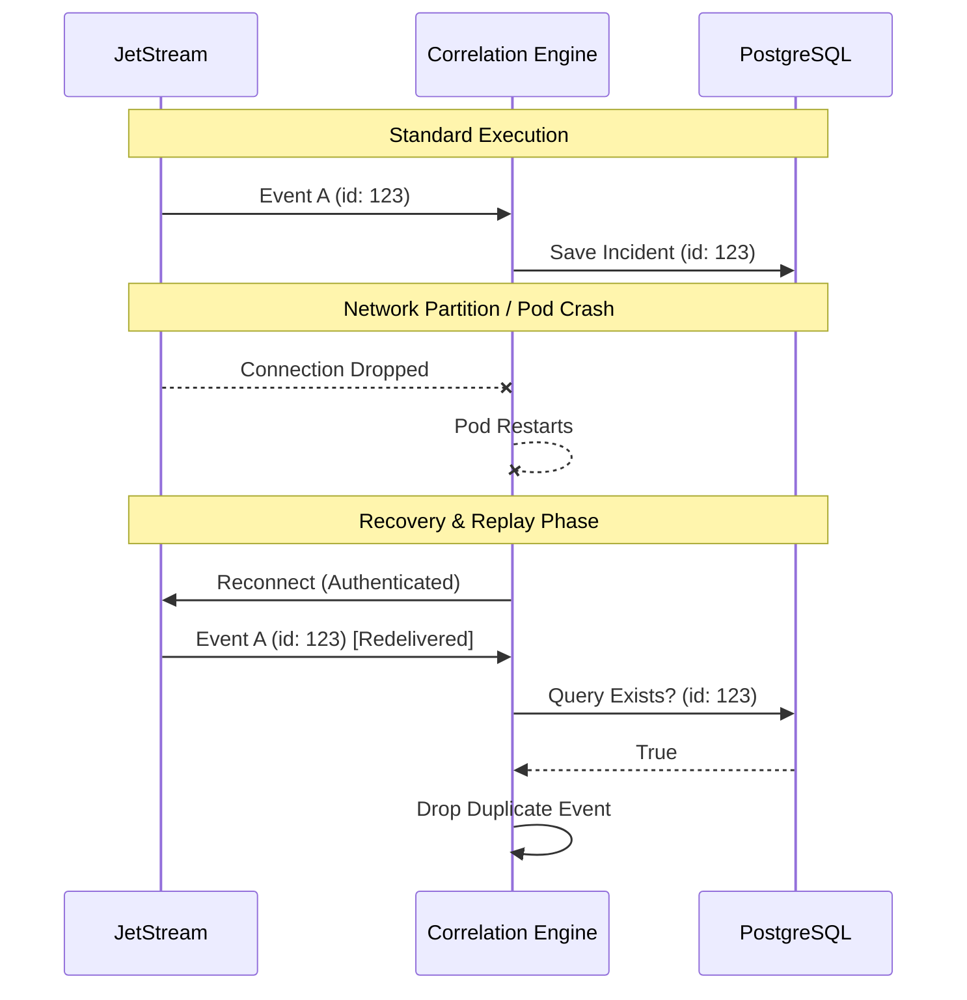
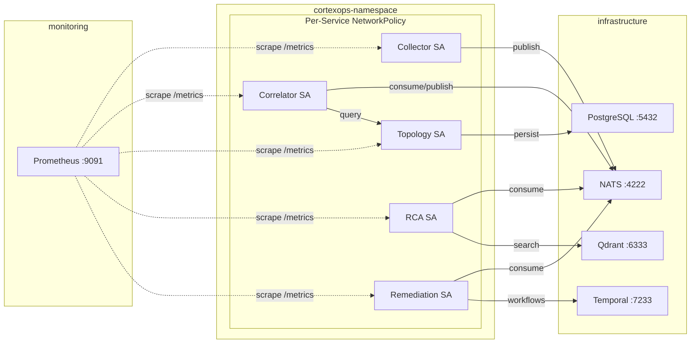
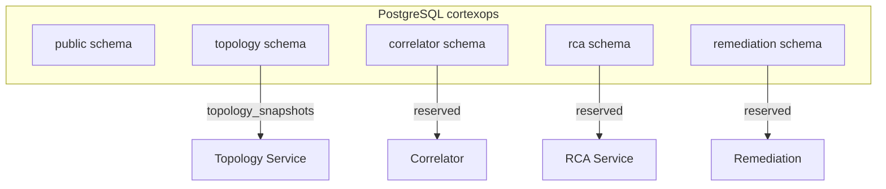
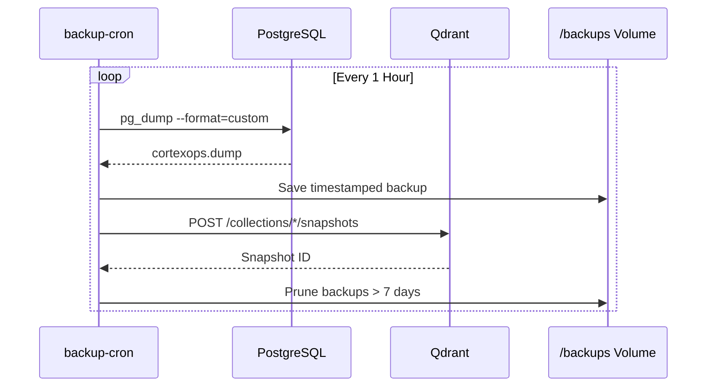

# CortexOps Architecture Diagrams

These diagrams provide operational clarity into the distributed nature of CortexOps.

## 1. High-Level System Architecture

## 2. Remediation Lifecycle (Temporal Workflow)

## 3. Replay & Recovery Flow (Chaos Degradation)

## 4. Network Security Architecture

## 5. Database Schema Isolation

## 6. Backup & Recovery Flow

