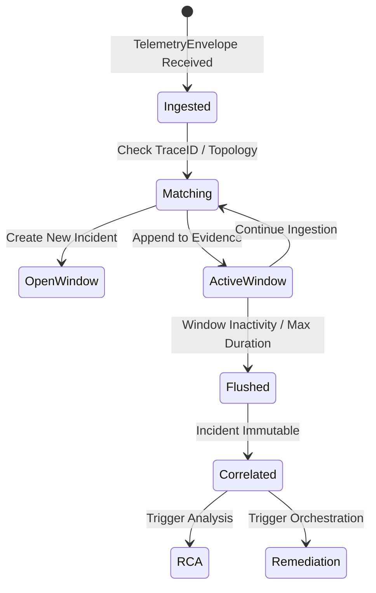

# Event Correlation Lifecycle

Events are correlated into incidents based on temporal proximity and topological affinity.

```mermaid
stateDiagram-v2
    [*] --> Ingested: TelemetryEnvelope Received
    Ingested --> Matching: Check TraceID / Topology
    Matching --> OpenWindow: Create New Incident
    Matching --> ActiveWindow: Append to Evidence
    ActiveWindow --> Matching: Continue Ingestion
    ActiveWindow --> Flushed: Window Inactivity / Max Duration
    Flushed --> Correlated: Incident Immutable
    Correlated --> RCA: Trigger Analysis
    Correlated --> Remediation: Trigger Orchestration
```
