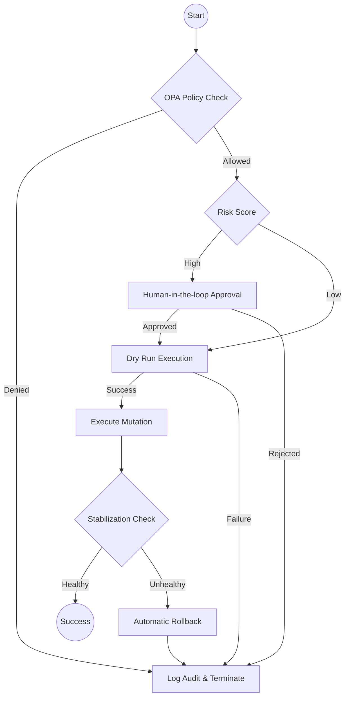

# Remediation Orchestration

CortexOps uses Temporal to ensure that infrastructure mutations are durable, traceable, and reversible.

```mermaid
flowchart TD
    Start((Start)) --> Policy{OPA Policy Check}
    Policy -->|Denied| Audit[Log Audit & Terminate]
    Policy -->|Allowed| Risk{Risk Score}
    Risk -->|High| Approval[Human-in-the-loop Approval]
    Risk -->|Low| DryRun[Dry Run Execution]
    Approval -->|Approved| DryRun
    Approval -->|Rejected| Audit
    DryRun -->|Success| Exec[Execute Mutation]
    DryRun -->|Failure| Audit
    Exec --> Verify{Stabilization Check}
    Verify -->|Healthy| Success((Success))
    Verify -->|Unhealthy| Rollback[Automatic Rollback]
    Rollback --> Audit
```
