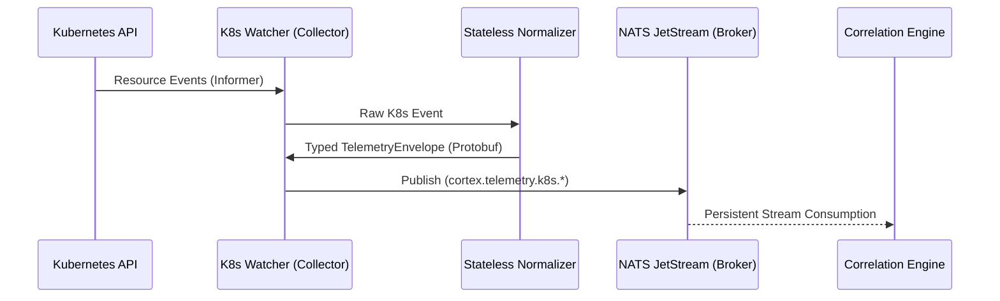

# Telemetry Ingestion Architecture

CortexOps uses a high-performance, event-driven pipeline to ingest and normalize infrastructure telemetry.

```mermaid
sequenceDiagram
    participant K8s as Kubernetes API
    participant Watcher as K8s Watcher (Collector)
    participant Normalizer as Stateless Normalizer
    participant NATS as NATS JetStream (Broker)
    participant Engine as Correlation Engine

    K8s->>Watcher: Resource Events (Informer)
    Watcher->>Normalizer: Raw K8s Event
    Normalizer->>Watcher: Typed TelemetryEnvelope (Protobuf)
    Watcher->>NATS: Publish (cortex.telemetry.k8s.*)
    NATS-->>Engine: Persistent Stream Consumption
```
