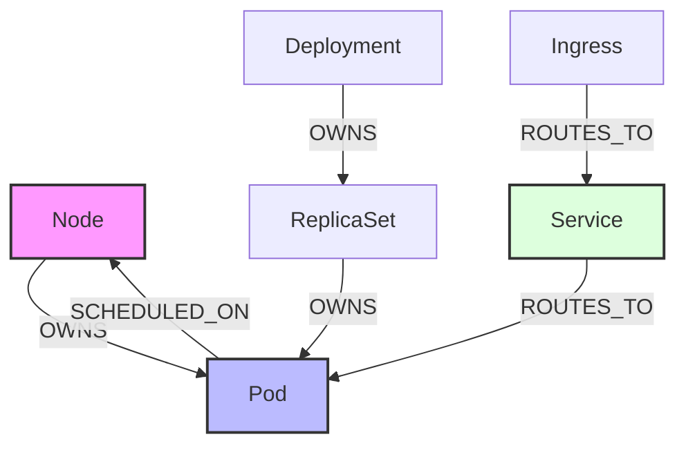

# Topology Graph Relationships

The Topology Engine maintains a real-time directed graph representing the physical and logical dependencies within the cluster.

```mermaid
graph TD
    Node[Node] -->|OWNS| Pod[Pod]
    ReplicaSet[ReplicaSet] -->|OWNS| Pod
    Deployment[Deployment] -->|OWNS| ReplicaSet
    Service[Service] -->|ROUTES_TO| Pod
    Ingress[Ingress] -->|ROUTES_TO| Service
    Pod -->|SCHEDULED_ON| Node
    
    style Node fill:#f9f,stroke:#333,stroke-width:2px
    style Pod fill:#bbf,stroke:#333,stroke-width:2px
    style Service fill:#dfd,stroke:#333,stroke-width:2px
```
